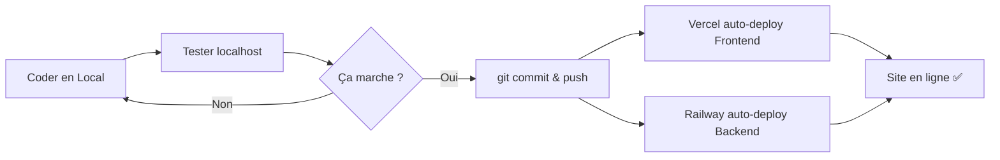

# 🚀 Guide de Déploiement - Sintra AI

## 📋 Vue d'ensemble

Ce guide vous montre comment **héberger votre site en ligne** tout en **continuant à le modifier** avec l'assistant IA.

---

## 🎯 Solution Recommandée : GitHub + Déploiement Automatique

### Avantages :
✅ **Gratuit** (pour les plans de base)
✅ **Déploiement automatique** à chaque modification
✅ **Collaboratif** - continuez à coder avec l'IA
✅ **Sauvegarde** automatique de votre code
✅ **Facile** à configurer

---

## 🔧 Étape 1 : Initialiser Git et GitHub

### 1.1 Créer un dépôt Git local

```bash
cd "/Users/teddy-vann/Desktop/agent ia"

# Initialiser Git
git init

# Ajouter tous les fichiers
git add .

# Premier commit
git commit -m "🚀 Initial commit - Sintra AI système complet"
```

### 1.2 Créer un dépôt sur GitHub

1. **Aller sur** [github.com](https://github.com)
2. **Cliquer** sur "New repository"
3. **Nom** : `sintra-ai`
4. **Description** : "Système d'agents IA autonomes avec 7 agents spécialisés"
5. **Visibilité** : Private (ou Public si vous voulez)
6. **Ne pas** initialiser avec README (vous en avez déjà un)
7. **Créer** le repository

### 1.3 Connecter et pousser

```bash
# Remplacer YOUR_USERNAME par votre nom d'utilisateur GitHub
git remote add origin https://github.com/YOUR_USERNAME/sintra-ai.git

# Pousser le code
git branch -M main
git push -u origin main
```

---

## 🌐 Étape 2 : Déployer le Frontend (Vercel)

### 2.1 Pourquoi Vercel ?
- ✅ **Gratuit** pour projets personnels
- ✅ **Optimisé** pour Next.js
- ✅ **Déploiement automatique** depuis GitHub
- ✅ **SSL/HTTPS** gratuit
- ✅ **CDN mondial**

### 2.2 Déployer sur Vercel

1. **Aller sur** [vercel.com](https://vercel.com)
2. **Se connecter** avec GitHub
3. **Cliquer** sur "Add New Project"
4. **Importer** votre repo `sintra-ai`
5. **Configuration** :
   - **Framework Preset** : Next.js
   - **Root Directory** : `frontend`
   - **Build Command** : `npm run build`
   - **Output Directory** : `.next`
   
6. **Variables d'environnement** :
   ```
   je 
   =https://votre-backend.railway.app/api
   ```
   (on configurera l'URL du backend après)

7. **Cliquer** sur "Deploy"

**Résultat** : Votre frontend sera disponible sur `https://votre-projet.vercel.app` 🎉

---

## ⚙️ Étape 3 : Déployer le Backend (Railway.app)

### 3.1 Pourquoi Railway ?
- ✅ **Gratuit** ($5 de crédit/mois gratuit)
- ✅ **Support Python**
- ✅ **Variables d'environnement**
- ✅ **Déploiement automatique** depuis GitHub
- ✅ **Base de données** PostgreSQL intégrée

### 3.2 Préparer le Backend

#### Créer `Procfile` (pour Railway)
```bash
cat > Procfile << 'EOF'
web: uvicorn main:app --host 0.0.0.0 --port $PORT
EOF
```

#### Créer `railway.json`
```bash
cat > railway.json << 'EOF'
{
  "$schema": "https://railway.app/railway.schema.json",
  "build": {
    "builder": "NIXPACKS"
  },
  "deploy": {
    "startCommand": "uvicorn main:app --host 0.0.0.0 --port $PORT",
    "restartPolicyType": "ON_FAILURE",
    "restartPolicyMaxRetries": 10
  }
}
EOF
```

#### Créer `runtime.txt` (spécifier Python 3.9)
```bash
echo "python-3.9.18" > runtime.txt
```

### 3.3 Déployer sur Railway

1. **Aller sur** [railway.app](https://railway.app)
2. **Se connecter** avec GitHub
3. **Cliquer** sur "New Project"
4. **Sélectionner** "Deploy from GitHub repo"
5. **Choisir** votre repo `sintra-ai`
6. **Configuration** :
   - **Root Directory** : laisser vide (racine)
   
7. **Variables d'environnement** :
   ```
   OPENAI_API_KEY=sk-svcacct-TtYI...fMMA
   ANTHROPIC_API_KEY=votre-clé-anthropic
   ENVIRONMENT=production
   PORT=8000
   ```

8. **Déployer**

**Résultat** : Votre backend sera sur `https://votre-projet.railway.app` 🎉

### 3.4 Mettre à jour l'URL du Frontend

1. **Retourner sur Vercel**
2. **Paramètres** → **Environment Variables**
3. **Modifier** `NEXT_PUBLIC_API_URL` :
   ```
   NEXT_PUBLIC_API_URL=https://votre-backend.railway.app/api
   ```
4. **Redéployer** le frontend

---

## 🔄 Étape 4 : Workflow de Développement

### Comment continuer à modifier avec l'IA ?

#### Scénario typique :

1. **Vous codez** avec l'assistant IA en local
2. **Testez** sur `localhost:3000` et `localhost:8000`
3. **Quand satisfait**, poussez sur GitHub :
   ```bash
   git add .
   git commit -m "✨ Ajout de nouvelle fonctionnalité"
   git push
   ```
4. **Déploiement automatique** ! 🚀
   - Vercel redéploie le frontend
   - Railway redéploie le backend

### Commandes Git essentielles :

```bash
# Voir les modifications
git status

# Ajouter tous les changements
git add .

# Commit avec message
git commit -m "Description de vos changements"

# Pousser vers GitHub (déclenche le déploiement)
git push

# Voir l'historique
git log --oneline

# Annuler les dernières modifications (avant commit)
git checkout -- .
```

---

## 🎯 Solution Alternative : VPS avec Docker

### Si vous voulez plus de contrôle

#### Avantages :
- ✅ Contrôle total du serveur
- ✅ Pas de limites de ressources
- ✅ Peut héberger plusieurs projets

#### Providers recommandés :
- **DigitalOcean** - $6/mois (Droplet)
- **Hetzner** - €4.51/mois (CX11)
- **Linode** - $5/mois (Nanode)
- **OVH** - €3.50/mois (VPS Starter)

#### Étape rapide :

1. **Créer un VPS** (Ubuntu 22.04)

2. **Se connecter en SSH** :
   ```bash
   ssh root@votre-ip-vps
   ```

3. **Installer Docker** :
   ```bash
   curl -fsSL https://get.docker.com -o get-docker.sh
   sh get-docker.sh
   ```

4. **Créer `docker-compose.yml`** :
   ```yaml
   version: '3.8'
   
   services:
     backend:
       build: .
       ports:
         - "8000:8000"
       environment:
         - OPENAI_API_KEY=votre-clé
       restart: unless-stopped
     
     frontend:
       build: ./frontend
       ports:
         - "3000:3000"
       environment:
         - NEXT_PUBLIC_API_URL=http://votre-ip:8000/api
       restart: unless-stopped
   ```

5. **Lancer** :
   ```bash
   docker-compose up -d
   ```

6. **Configurer Nginx** (reverse proxy) pour avoir un vrai domaine

---

## 🔐 Sécurité et Bonnes Pratiques

### ⚠️ IMPORTANT - À faire AVANT de pousser sur GitHub :

#### 1. Créer `.gitignore` (si pas déjà fait)
```bash
cat > .gitignore << 'EOF'
# Environnement Python
venv/
__pycache__/
*.pyc
*.pyo
*.pyd
.Python
*.so
*.egg-info/

# Variables d'environnement
.env
.env.local
.env.production

# Node
node_modules/
.next/
out/
dist/

# Logs
*.log
logs/

# OS
.DS_Store
Thumbs.db

# IDE
.vscode/
.idea/
*.swp
*.swo

# Base de données
*.db
*.sqlite
*.sqlite3

# Autres
*.pyc
.pytest_cache/
.coverage
EOF
```

#### 2. Vérifier que `.env` n'est PAS dans Git
```bash
# Si .env est déjà tracké, le retirer :
git rm --cached .env
git commit -m "🔒 Remove .env from tracking"
```

#### 3. Utiliser des variables d'environnement sur les plateformes
- **NE JAMAIS** mettre les clés API dans le code
- **TOUJOURS** utiliser les variables d'environnement de Vercel/Railway

---

## 📊 Comparaison des Solutions

| Critère | Vercel + Railway | VPS + Docker | Heroku |
|---------|------------------|--------------|---------|
| **Prix** | Gratuit | $5-6/mois | $7/mois |
| **Setup** | ⭐⭐⭐⭐⭐ | ⭐⭐⭐ | ⭐⭐⭐⭐ |
| **Auto-deploy** | ✅ | ❌ (manuel) | ✅ |
| **Scalabilité** | ⭐⭐⭐⭐ | ⭐⭐⭐⭐⭐ | ⭐⭐⭐ |
| **Contrôle** | ⭐⭐⭐ | ⭐⭐⭐⭐⭐ | ⭐⭐⭐ |
| **Maintenance** | ⭐⭐⭐⭐⭐ | ⭐⭐ | ⭐⭐⭐⭐ |

**Recommandation** : Commencez avec **Vercel + Railway** (gratuit et facile)

---

## 🎓 Tutoriel Pas à Pas pour Débutants

### Méthode la Plus Simple (GUI uniquement)

#### Pour le Frontend :

1. **GitHub Desktop** (télécharger sur desktop.github.com)
   - Ouvrir GitHub Desktop
   - File → Add Local Repository → Sélectionner votre dossier
   - Commit → Push origin

2. **Vercel** (via interface web)
   - Se connecter avec GitHub
   - Import Project → Sélectionner votre repo
   - Framework: Next.js
   - Root: `frontend`
   - Deploy !

#### Pour le Backend :

1. **Railway** (via interface web)
   - Se connecter avec GitHub
   - New Project → Deploy from GitHub
   - Sélectionner votre repo
   - Ajouter les variables d'environnement
   - Deploy !

---

## 🔧 Dépannage

### Problème : Le frontend ne se connecte pas au backend
**Solution** : Vérifier la variable `NEXT_PUBLIC_API_URL` sur Vercel

### Problème : Erreur de build sur Railway
**Solution** : Vérifier que `requirements.txt` et `Procfile` sont à la racine

### Problème : "Module not found"
**Solution** : S'assurer que tous les packages sont dans `requirements.txt`

### Problème : CORS errors
**Solution** : Ajouter le domaine Vercel dans les CORS du backend :
```python
# Dans main.py
app.add_middleware(
    CORSMiddleware,
    allow_origins=[
        "https://votre-projet.vercel.app",
        "http://localhost:3000"
    ],
    ...
)
```

---

## 📱 Domaine Personnalisé (Optionnel)

### Avec Vercel (Frontend)
1. Acheter un domaine (Namecheap, Google Domains, etc.)
2. Dans Vercel : Settings → Domains
3. Ajouter votre domaine
4. Suivre les instructions pour configurer les DNS

### Avec Railway (Backend)
1. Settings → Networking
2. Generate Domain ou ajouter un domaine custom

---

## 🚀 Commandes Rapides

### Déploiement en Une Ligne
```bash
# Après vos modifications en local
git add . && git commit -m "Update" && git push
```

### Voir les logs du backend (Railway)
```bash
railway logs
```

### Rollback si problème
```bash
# Sur Railway, aller dans Deployments et cliquer sur une version précédente
```

---

## 📈 Monitoring et Analytics

### Outils Gratuits Recommandés :

1. **Vercel Analytics** - Built-in, gratuit
2. **Railway Logs** - Logs en temps réel
3. **Google Analytics** - Pour le frontend
4. **Sentry** - Tracking d'erreurs (gratuit jusqu'à 5k events/mois)

---

## 💡 Workflow Optimal



---

## 🎯 Checklist de Déploiement

- [ ] `.gitignore` configuré
- [ ] `.env` NON commité
- [ ] Code poussé sur GitHub
- [ ] Frontend déployé sur Vercel
- [ ] Backend déployé sur Railway
- [ ] Variables d'environnement configurées
- [ ] URL du backend mise à jour dans le frontend
- [ ] Test du site en production
- [ ] Configuration du domaine (optionnel)

---

## 🆘 Besoin d'Aide ?

Si vous avez des questions ou rencontrez des problèmes :

1. **Vérifier les logs** sur Vercel/Railway
2. **Tester en local** d'abord
3. **Demander à l'assistant IA** de vous aider à débugger
4. **Consulter la doc** : 
   - [Vercel Docs](https://vercel.com/docs)
   - [Railway Docs](https://docs.railway.app)

---

**🎉 Félicitations ! Votre Sintra AI est maintenant en ligne et vous pouvez continuer à le modifier avec l'assistant IA !**

